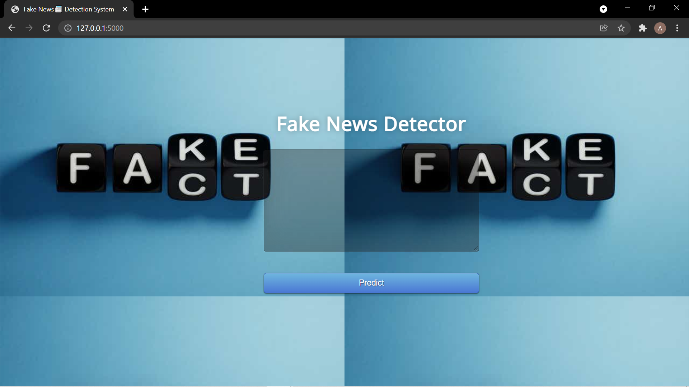
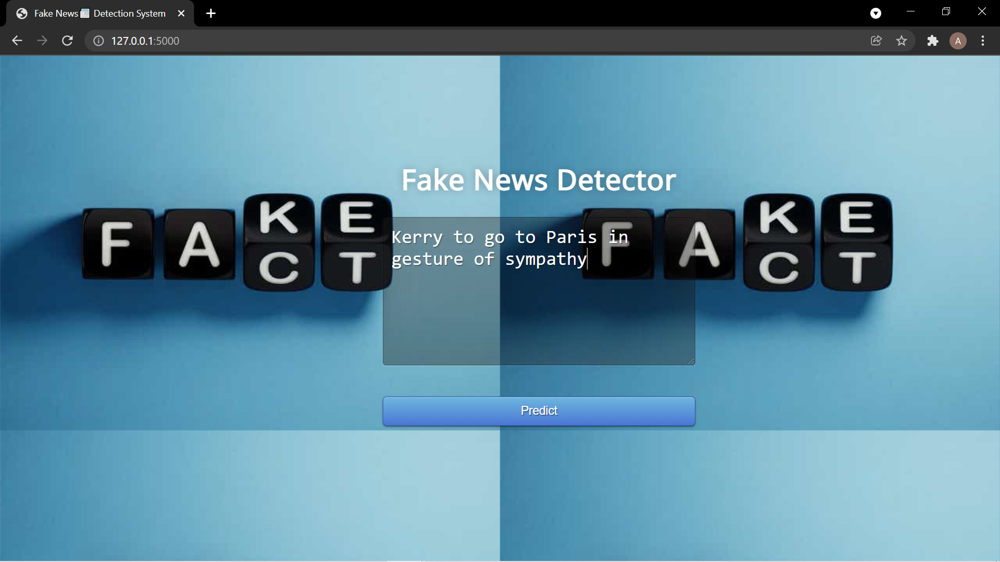
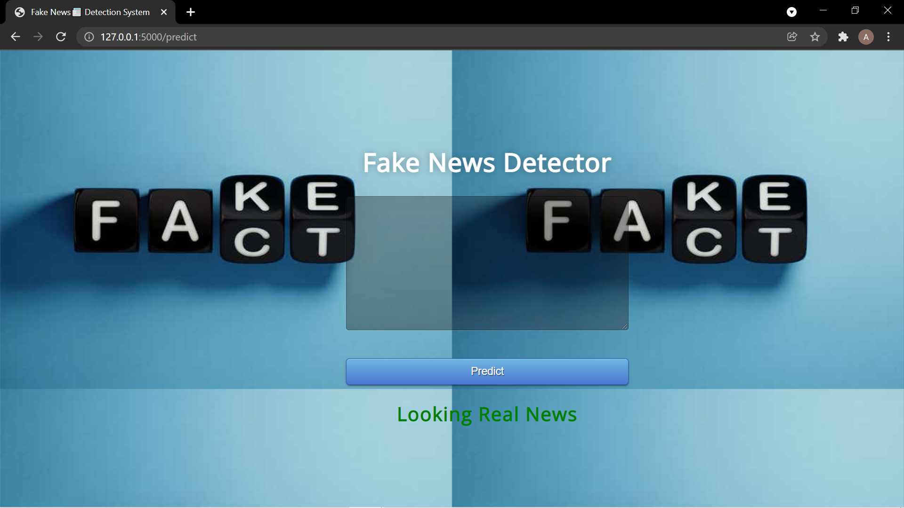
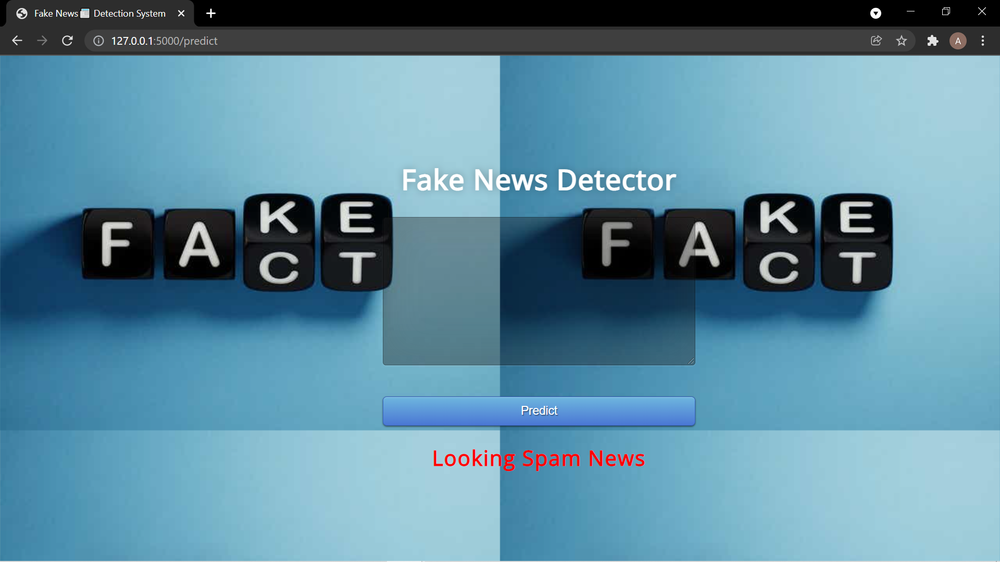

#  Fake News📰 Classification WebApp using Python

## The Problem !
    The problem is not only hackers, going into accounts, and sending false information. 
    The bigger problem here is what we call "Fake News". A fake are those news stories that are false: the story itself is fabricated, with no verifiable facts,sources, or quotes.
    
    When someone (or something like a bot) impersonates someone or a reliable source to false spread information, 
    that can also be considered as fake news. In most cases, the people creating this false information have an agenda, that can be political, 
    economical or to change the behavior or thought about a topic.
    There are countless sources of fake news nowadays, mostly coming from programmed bots, 
    that can't get tired (they're machines hehe) and continue. to spread false information 24/7.
    
    Serious studies in the past 5 years, have demonstrated big correlations between 
    the spread of false information and elections, the popular opinion or feelings about different topics.
    
    The problem is real and hard to solve because the bots are getting better are tricking us. 
    Is not simple to detect when the information is true or not all the time, so we 
    need better systems that help us understand the patterns of fake news to improve our social media, communication and to prevent confusion in the world.

## Working:
    The project has been divided in 7 steps:
    • #Step-1 Loading Dataset
    • #Step-2 Data Preprocessing
    • #Step-3 Data Exploratory Analysis (EDA)
    • #Step-4 Text Preprocessing
    • #Step-5 Modeling Classifier
    • #Step-6 Loading Flask Server
    • #Step-7 Deploying on web
    
## Techniques Incorporated:
    • NLP:
        • TfIdfVectorizer
    • Modelling:
        • PassiveAggressiveClassifier (Accuracy 93.69 %)
    
## Novelty:
    • Reduced Complexity Standards at high rates with easy to use ui
    • Fast and sound classifier model

## Screenshots

### Real News Prediction

### Fake News Prediction

